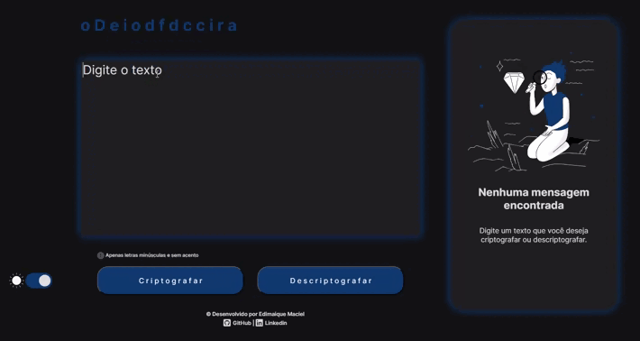
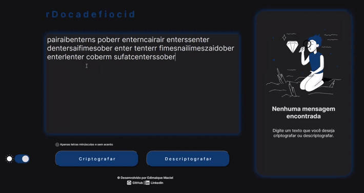

<h1 align="center">Challenge Alura + ONE - Decodificador de texto</h1>
<h1 align="center">--Preview--</h1>
  
<h2><ul><li>Criptografando</li></ul></h2>

  
<h2><ul><li>Desriptografando</li></ul></h2>

  
<h2><ul><li>Alternando entre os Modo escuro/Modo claro</li></ul></h2>

  
<h2><ul><li>Tablet</li></ul></h2>

  
<h2><ul><li>Smartphone</li></ul></h2>

  

## Descrição
Este repositório contém o código para uma aplicação que criptografa e descriptografa textos utilizando um algoritmo simples de substituição de letras. A aplicação é baseada no primeiro desafio do programa ONE da Oracle + Alura.

## Funcionalidades
- Criptografa e descriptografa textos com base nas seguintes regras:
  - "e" é convertido para "enter"
  - "i" é convertido para "imes"
  - "a" é convertido para "ai"
  - "o" é convertido para "ober"
  - "u" é convertido para "ufat"
- Funciona apenas com letras minúsculas
- Não utiliza letras com acentos nem caracteres especiais
- Permite converter uma palavra para a versão criptografada e vice-versa
- Possui campos para inserção do texto e seleção da operação (criptografar ou descriptografar)
- Exibe o resultado na tela
- Possui um botão para copiar o texto criptografado/descriptografado para a área de transferência

## Funcionalidades Extras
- Aviso de erro ao tentar inserir letras maiúsculas ou caracteres especiais usando Alert.
- Aviso de texto copiado com sucesso ou caso de erro usando Alert.
- Efeito Máquina de escrever ao mostrar o texto criptografado ou descriptografado.
- Animação das letras do título sendo embaralhadas e formando a palavra "Decodificador".
- Modo escuro ou Modo claro.
- Site Responsivo, se adaptando a Desktops, Tablets e Smartphones.

## Tecnologias Utilizadas

## Instalação
1. Clone o repositório para o seu computador.
2. Abra o index.html em um navegador web.
3. Utilize os campos para inserir o texto e selecionar a operação desejada.
4. Clique no botão "Criptografar" ou "Descriptografar" para obter o resultado.
5. Se estiver utilizando o botão de copiar, clique nele para copiar o texto criptografado/descriptografado para a área de transferência.

